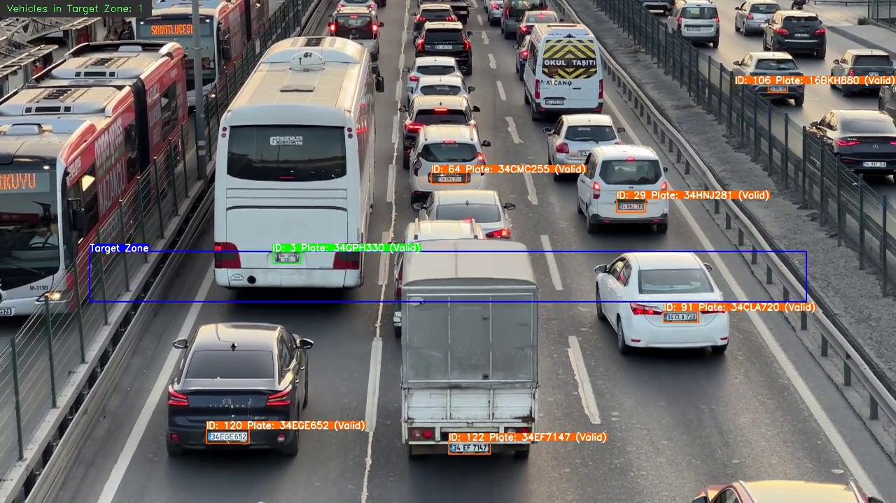

## 🚗 YOLO-OCR Turkish License Plate Counter and Tracker 🇹🇷

This project implements a robust computer vision pipeline for detecting, tracking, reading (OCR), and counting **Turkish** license plates in video streams. **The regex patterns used for validation are specifically tailored to common Turkish plate formats, as the dataset and context involve Turkish vehicle traffic.**

It uses the YOLOv8 object detection framework for plate localization and tracking, combined with PaddleOCR for text recognition, and a custom **Character Majority Voting** algorithm for stable, history-based plate reconstruction.

The system is designed to provide highly accurate, stable plate readings even when individual frame-level OCR readings are noisy or incorrect.

---

### ✨ Key Features

* **YOLOv8 Plate Detection & Tracking:** Identifies license plates and maintains a unique `track_id` for each vehicle across frames.
* **PaddleOCR Integration:** Performs optical character recognition on cropped license plate regions.
* **Stable Plate Reconstruction (Majority Voting):** Collects multiple valid readings for a single `track_id` and uses character-by-character voting to determine the most probable, stable plate string.

* **Turkish Plate Validation:** Uses regex patterns to filter out invalid or erroneous OCR readings, ensuring only syntactically correct plate numbers are used for counting and reconstruction.
* **Passthrough Counter:** Counts vehicles only when they pass through a defined "Target Zone."
* **Visual Stability:** Tracking box color and displayed plate status (`Valid`/`Invalid`) are based on the stable, reconstructed plate's validity, preventing visual flickering.
* **CSV Output:** Aggregates final counts and stable plate numbers to a clean CSV file.

### 🖼️ Demonstration

Here is an example frame showing the tracking and labeling system in action:



#### Labeling Color Key:

| Status (Plate) | State (Zone) | BGR Value (B, G, R) | Color Name | Meaning |
| :--- | :--- | :--- | :--- | :--- |
| **Valid** | **IN Zone** | `(0, 255, 0)` | Bright Green | Vehicle is inside the zone; plate reading is **stable and valid**. (Best Outcome) |
| **Valid** | **OUT Zone** | `(0, 100, 255)` | Red-Orange | Vehicle is outside the zone; plate reading is **stable and valid**. (High Red/Low Blue) |
| **Invalid** | **IN Zone** | `(255, 165, 0)` | Cyan/Aqua | Vehicle is inside the zone; plate reading is **invalid/unknown**. (Warning in count zone) |
| **Invalid** | **OUT Zone** | `(255, 0, 0)` | Bright Blue | Vehicle is outside the zone; plate reading is **invalid/unknown**. (Worst Outcome - Pure Blue) |

---

### ⚙️ Installation and Setup

#### Prerequisites

1.  Python 3.8+
2.  CUDA (for GPU acceleration, highly recommended for YOLO and PaddleOCR)

#### Installation Steps

1.  **Clone the Repository:**
    ```bash
    git clone [YOUR_REPO_URL]
    cd yolov_plate_counter
    ```

2.  **Install Dependencies:**
    ```bash
    pip install -r requirements.txt
    ```
    *(Note: The required packages include `ultralytics`, `opencv-python`, `paddleocr`, `imageio`, and supporting libraries.)*

3.  **Place Model Weights:**
    Ensure your YOLO model weights (`license-plate-finetune-v1x.pt`) and your input video (`cartraffic.mp4`) are correctly placed as referenced in the script's configuration variables.

### ▶️ Usage

Simply run the main Python script. The script will process the video, display the output in real-time, and save the results.

```bash
python YOLO_OCR_Car_Plate_Reader_PassthroughCounter.py

### 📁 Output Files

The script generates two output files in the `output/` directory:

1.  **`yolov_plate_passthrough_counter_voted.mp4`**: The output video file with bounding boxes, labels, and the pass count overlay.
2.  **`plate_records_pass_voted.csv`**: A Report of the final aggregated counts.

### 🧠 Core Logic Breakdown

The stability and accuracy of this system rely on the **Reconstruction Logic** defined in the `reconstruct_best_plate` function:

1.  **Collect History:** The `track_all_plates_dict` stores every single OCR reading that was valid (matched Turkish patterns) for a given `track_id`.
2.  **Determine Majority Length:** It finds the most common string length among all collected readings (e.g., if most plates were 6 characters long, it ignores the 5- or 7-character misreads).
3.  **Character Voting:** For every position in the plate (e.g., the 4th character), it performs a vote across all history readings to select the character that appeared most often in that exact position.

4.  **Final Validation:** The resulting stable plate string is checked one last time against the Turkish plate patterns (`is_valid_plate`). This final validity check drives the visual feedback (box color) on the video output.
